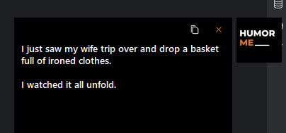
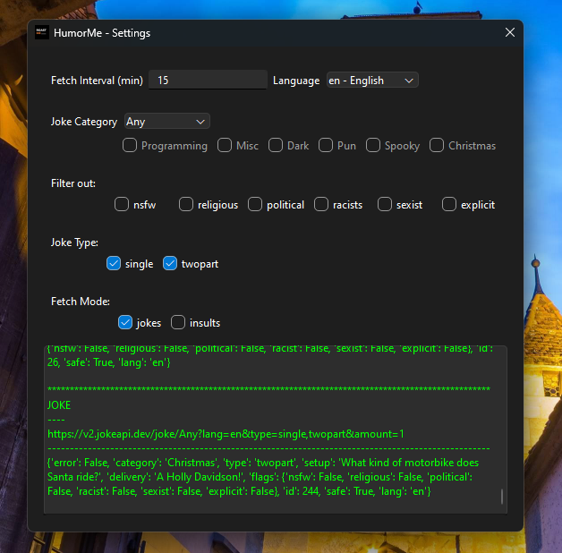

# Humor Me
A customizable joke teller. Jokes are gotten from [JokesAPI](https://jokesapi.dev). Insults are gotten from [EvilInsults](https://evilinsults.com/api)
Creates a floating window that shows content (jokes/insults)



## For Devs
To build locally
1. have python installed
2. clone repo and create virtual environment
3. install requirements
   ```console
        pip install -r requirement.txt
   ```
4. run application
    ```console
        python app.py   
    ```
5. To build deploy see [here](https://doc.qt.io/qtforpython-6/deployment/index.html)

## Installation (Windows)
- Download the current release from [here](https://github.com/Ndeh-007/RoastMe/releases/download/v1.0.0/HumorMe.zip)
- Extract to suitable location
- Run the installer
- There maybe an antivirus warning. Ignore.


## Usage

Run the installed application. A bubble will appear at the top-right corner of your main desktop window. A settings menu 
will also be shown by default. Closing the settings menu will not terminate the application. 

To terminate application, open the system tray, click on the application and select quit.

When a joke is told, the bubble will automatically hide after 1 min


### Configuration
To open the settings window, right-click on the bubble and select settings



1. The fetch interval is the time between jokes told.
2. language is what language you want the joke to come in
3. Category offers the selected spools of jokes to be told
4. Filter out certain kinds of jokes
5. Joke type will ensure you either of the two. one must be selected. if none are selected, the application will default to both types
6. you can decide to get jokes as well as insults. (the configuration works only for the jokes.)
7. The console shows the progression.